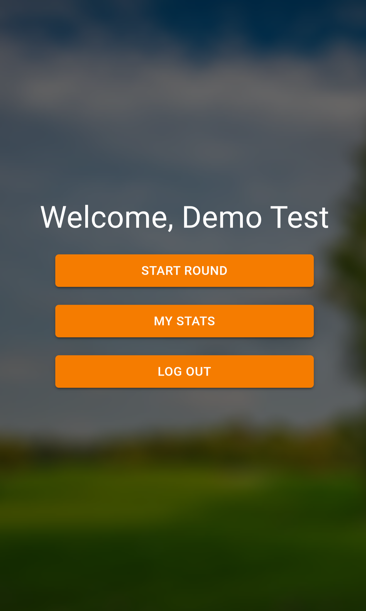
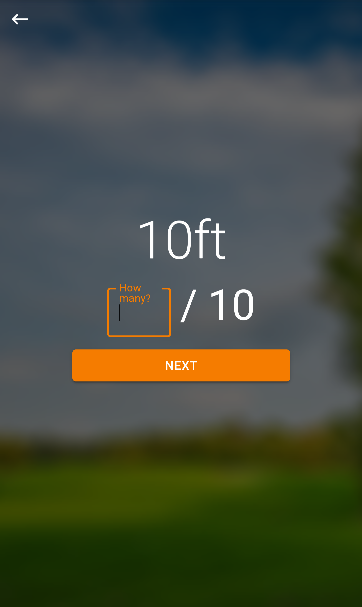
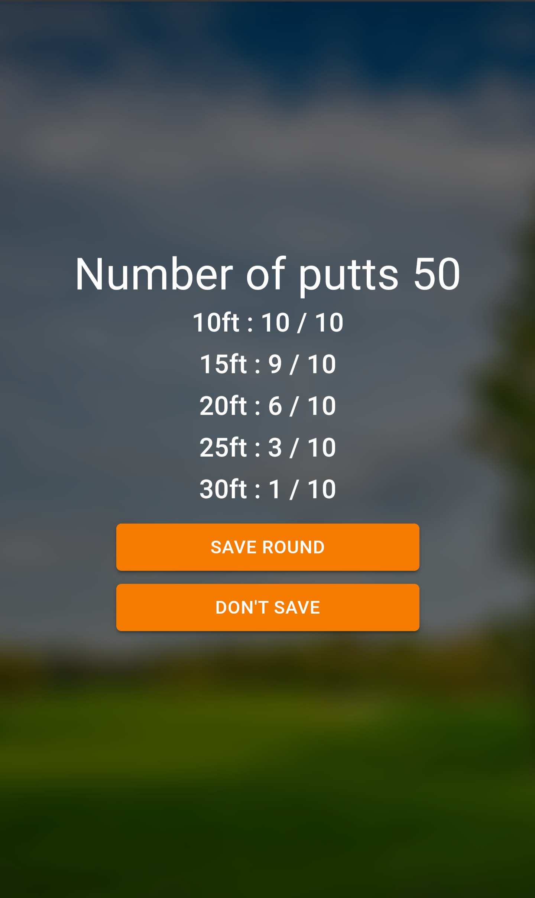
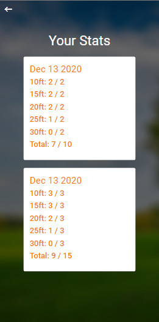

# Putting Tracker

    Live Link: Live Link: https://putting-app.herokuapp.com/

## Purpose

    This app was developed to help track my disc golf putting practice

## Built Using

- React.js
- Material UI
- Node.js
- Express.js
- MongoDB
- Mongoose ODM

## What's it look like?

## Home

## Dashboard

## Practice

## Results

## Stats

